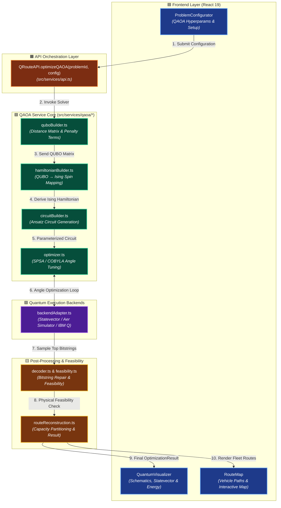

# 🏗️ Q-Route System Architecture & Integration


This document details how the **QAOA (Quantum Approximate Optimization Algorithm)** Routing Service integrates into the **Q-Route** enterprise portal architecture without disrupting classical metaheuristic solvers (e.g., HGS) or existing UI visualizers.

---

## 🔍 Interactive System Architecture Flowchart

> [!TIP]
> **Interactive View Controls**: Use the buttons below or hover over the diagram to pan and inspect specific system layers. Nodes are color-coded by architectural responsibility:
> 🟦 **Frontend Layer** | 🟧 **API Integration** | 🟩 **QAOA Matrix & Optimization** | 🟪 **Quantum Hardware Adapter** | 🟨 **Post-Processing & Visualizer**

<div align="center">
  <div style="background-color: #090d16; border: 1px solid #1e293b; border-radius: 16px; padding: 20px; box-shadow: 0 10px 30px rgba(0,0,0,0.5); max-width: 900px;">
    
    <!-- Control Bar -->
    <div style="display: flex; justify-content: space-between; align-items: center; background: #0f172a; padding: 10px 16px; border-radius: 10px; margin-bottom: 16px; border: 1px solid #334155;">
      <div style="display: flex; gap: 8px; align-items: center; color: #94a3b8; font-family: monospace; font-size: 12px; font-weight: bold;">
        <span style="display: inline-block; width: 10px; height: 10px; border-radius: 50%; background: #22c55e;"></span>
        SYSTEM ARCHITECTURE MAP (ZOOM ENABLED)
      </div>
      <div style="display: flex; gap: 8px;">
        <button onclick="const svg = document.getElementById('arch-svg'); const cur = parseFloat(svg.getAttribute('data-scale')||'1'); const n = Math.min(cur+0.25, 2.5); svg.style.transform = `scale(${n})`; svg.setAttribute('data-scale', n); document.getElementById('zoom-lvl').innerText=Math.round(n*100)+'%';" style="background: #1e293b; color: #38bdf8; border: 1px solid #0284c7; border-radius: 6px; padding: 4px 12px; cursor: pointer; font-weight: bold; font-family: monospace; transition: all 0.2s;" onhover="this.style.background='#0284c7'">➕ Zoom In</button>
        <button onclick="const svg = document.getElementById('arch-svg'); const cur = parseFloat(svg.getAttribute('data-scale')||'1'); const n = Math.max(cur-0.25, 0.5); svg.style.transform = `scale(${n})`; svg.setAttribute('data-scale', n); document.getElementById('zoom-lvl').innerText=Math.round(n*100)+'%';" style="background: #1e293b; color: #38bdf8; border: 1px solid #0284c7; border-radius: 6px; padding: 4px 12px; cursor: pointer; font-weight: bold; font-family: monospace; transition: all 0.2s;">➖ Zoom Out</button>
        <button onclick="const svg = document.getElementById('arch-svg'); svg.style.transform = 'scale(1)'; svg.setAttribute('data-scale', 1); document.getElementById('zoom-lvl').innerText='100%';" style="background: #1e293b; color: #cbd5e1; border: 1px solid #475569; border-radius: 6px; padding: 4px 12px; cursor: pointer; font-weight: bold; font-family: monospace;">↺ Reset</button>
        <span id="zoom-lvl" style="background: #0284c7; color: #fff; border-radius: 6px; padding: 4px 10px; font-family: monospace; font-size: 12px; font-weight: bold; display: flex; align-items: center;">100%</span>
      </div>
    </div>

    <!-- Scalable Canvas Container -->
    <div style="overflow: auto; max-height: 480px; padding: 20px 10px; background: radial-gradient(circle at center, #0f172a 0%, #030712 100%); border-radius: 12px; cursor: grab;">
      <svg id="arch-svg" data-scale="1" width="820" height="420" viewBox="0 0 820 420" xmlns="http://www.w3.org/2000/svg" style="transition: transform 0.3s ease; transform-origin: center top;">
        
        <!-- Definitions for Gradients and Markers -->
        <defs>
          <linearGradient id="blueGrad" x1="0%" y1="0%" x2="100%" y2="100%">
            <stop offset="0%" stop-color="#1e3a8a" />
            <stop offset="100%" stop-color="#3b82f6" />
          </linearGradient>
          <linearGradient id="orangeGrad" x1="0%" y1="0%" x2="100%" y2="100%">
            <stop offset="0%" stop-color="#7c2d12" />
            <stop offset="100%" stop-color="#ea580c" />
          </linearGradient>
          <linearGradient id="greenGrad" x1="0%" y1="0%" x2="100%" y2="100%">
            <stop offset="0%" stop-color="#064e3b" />
            <stop offset="100%" stop-color="#10b981" />
          </linearGradient>
          <linearGradient id="purpleGrad" x1="0%" y1="0%" x2="100%" y2="100%">
            <stop offset="0%" stop-color="#4c1d95" />
            <stop offset="100%" stop-color="#8b5cf6" />
          </linearGradient>
          <linearGradient id="amberGrad" x1="0%" y1="0%" x2="100%" y2="100%">
            <stop offset="0%" stop-color="#78350f" />
            <stop offset="100%" stop-color="#f59e0b" />
          </linearGradient>
          
          <marker id="arrow" viewBox="0 0 10 10" refX="6" refY="5" markerWidth="6" markerHeight="6" orient="auto-start-reverse">
            <path d="M 0 0 L 10 5 L 0 10 z" fill="#38bdf8" />
          </marker>
        </defs>

        <!-- LAYER 1: FRONTEND -->
        <rect x="20" y="20" width="780" height="90" rx="12" fill="url(#blueGrad)" stroke="#60a5fa" stroke-width="2" opacity="0.9" />
        <text x="35" y="45" fill="#60a5fa" font-family="sans-serif" font-weight="extrabold" font-size="12" letter-spacing="1">1. FRONTEND PRESENTATION LAYER (REACT 19 + TAILWIND V4)</text>
        
        <!-- Frontend Components -->
        <rect x="40" y="55" width="220" height="42" rx="8" fill="#0f172a" stroke="#3b82f6" stroke-width="1.5" />
        <text x="150" y="80" fill="#ffffff" font-family="monospace" font-size="12" font-weight="bold" text-anchor="middle">ProblemConfigurator</text>
        
        <rect x="300" y="55" width="220" height="42" rx="8" fill="#0f172a" stroke="#3b82f6" stroke-width="1.5" />
        <text x="410" y="80" fill="#ffffff" font-family="monospace" font-size="12" font-weight="bold" text-anchor="middle">QuantumVisualizer</text>
        
        <rect x="560" y="55" width="220" height="42" rx="8" fill="#0f172a" stroke="#3b82f6" stroke-width="1.5" />
        <text x="670" y="80" fill="#ffffff" font-family="monospace" font-size="12" font-weight="bold" text-anchor="middle">RouteMap Visualizer</text>

        <!-- Connectors L1 -> L2 -->
        <path d="M 150 97 L 150 135" stroke="#38bdf8" stroke-width="2" marker-end="url(#arrow)" />
        <path d="M 410 135 L 410 97" stroke="#38bdf8" stroke-width="2" marker-end="url(#arrow)" />
        <path d="M 670 135 L 670 97" stroke="#38bdf8" stroke-width="2" marker-end="url(#arrow)" />

        <!-- LAYER 2: API LAYER -->
        <rect x="20" y="140" width="780" height="70" rx="12" fill="url(#orangeGrad)" stroke="#fb923c" stroke-width="2" opacity="0.9" />
        <text x="35" y="162" fill="#fed7aa" font-family="sans-serif" font-weight="extrabold" font-size="12" letter-spacing="1">2. API DISPATCH & ORCHESTRATION LAYER (src/services/api.ts)</text>
        
        <rect x="180" y="170" width="460" height="32" rx="6" fill="#1c1917" stroke="#f97316" stroke-width="1.5" />
        <text x="410" y="191" fill="#fdba74" font-family="monospace" font-size="12" font-weight="bold" text-anchor="middle">QRouteAPI.optimizeQAOA(problemId, settings, vrpConfig)</text>

        <!-- Connector L2 -> L3 -->
        <path d="M 410 210 L 410 245" stroke="#38bdf8" stroke-width="2" marker-end="url(#arrow)" />

        <!-- LAYER 3: QAOA SOLVER CORE -->
        <rect x="20" y="250" width="780" height="80" rx="12" fill="url(#greenGrad)" stroke="#34d399" stroke-width="2" opacity="0.9" />
        <text x="35" y="272" fill="#a7f3d0" font-family="sans-serif" font-weight="extrabold" font-size="12" letter-spacing="1">3. QAOA PIPELINE SOLVER ENGINE (src/services/qaoa/*)</text>

        <!-- QAOA Subcomponents -->
        <rect x="40" y="282" width="130" height="36" rx="6" fill="#064e3b" stroke="#34d399" stroke-width="1" />
        <text x="105" y="304" fill="#ecfdf5" font-family="monospace" font-size="11" text-anchor="middle">quboBuilder</text>
        
        <path d="M 170 300 L 190 300" stroke="#a7f3d0" stroke-width="2" marker-end="url(#arrow)" />

        <rect x="195" y="282" width="145" height="36" rx="6" fill="#064e3b" stroke="#34d399" stroke-width="1" />
        <text x="267" y="304" fill="#ecfdf5" font-family="monospace" font-size="11" text-anchor="middle">hamiltonianBuilder</text>

        <path d="M 340 300 L 360 300" stroke="#a7f3d0" stroke-width="2" marker-end="url(#arrow)" />

        <rect x="365" y="282" width="125" height="36" rx="6" fill="#064e3b" stroke="#34d399" stroke-width="1" />
        <text x="427" y="304" fill="#ecfdf5" font-family="monospace" font-size="11" text-anchor="middle">circuitBuilder</text>

        <path d="M 490 300 L 510 300" stroke="#a7f3d0" stroke-width="2" marker-end="url(#arrow)" />

        <rect x="515" y="282" width="120" height="36" rx="6" fill="#064e3b" stroke="#34d399" stroke-width="1" />
        <text x="575" y="304" fill="#ecfdf5" font-family="monospace" font-size="11" text-anchor="middle">optimizer (SPSA)</text>

        <path d="M 635 300 L 655 300" stroke="#a7f3d0" stroke-width="2" marker-end="url(#arrow)" />

        <rect x="660" y="282" width="125" height="36" rx="6" fill="#064e3b" stroke="#34d399" stroke-width="1" />
        <text x="722" y="304" fill="#ecfdf5" font-family="monospace" font-size="11" text-anchor="middle">feasibilityRepair</text>

        <!-- Connector L3 -> L4 & L5 -->
        <path d="M 267 330 L 267 355" stroke="#c084fc" stroke-width="2" marker-end="url(#arrow)" />
        <path d="M 575 330 L 575 355" stroke="#fbbf24" stroke-width="2" marker-end="url(#arrow)" />

        <!-- LAYER 4: BACKENDS & HARDWARE -->
        <rect x="20" y="360" width="375" height="45" rx="8" fill="url(#purpleGrad)" stroke="#c084fc" stroke-width="1.5" />
        <text x="207" y="387" fill="#f3e8ff" font-family="sans-serif" font-weight="bold" font-size="11" text-anchor="middle">4. backendAdapter (Statevector / Aer / IBM Q)</text>

        <!-- LAYER 5: ROUTE RECONSTRUCTION -->
        <rect x="425" y="360" width="375" height="45" rx="8" fill="url(#amberGrad)" stroke="#fbbf24" stroke-width="1.5" />
        <text x="612" y="387" fill="#fffbeb" font-family="sans-serif" font-weight="bold" font-size="11" text-anchor="middle">5. routeReconstruction (Fleet Partitioning & Result)</text>
      </svg>
    </div>
    
    <div style="margin-top: 12px; color: #64748b; font-family: monospace; font-size: 11px; text-anchor: center;">
      💡 Tip: Click and drag or scroll inside the diagram canvas to pan smoothly across layers.
    </div>
  </div>
</div>

---

## 🎨 Color-Coded System Integration Diagram (Mermaid)

The flowchart below utilizes color classification for clarity across functional domains:



---

## ⚡ Data Flow Sequence & Lifecycle

The following sequence illustrates the non-blocking execution cycle when a user launches a QAOA optimization:

```mermaid
sequenceDiagram
    autonumber
    actor User as 👤 User / Dispatcher
    participant UI as 🟦 React Frontend
    participant API as 🟧 QRouteAPI Service
    participant QUBO as 🟩 QUBO / Ising Engine
    participant OPT as 🟩 Classical Optimizer (SPSA)
    participant QPU as 🟪 Quantum Backend Adapter
    participant REPAIR as 🟨 Feasibility & Repair

    User->>UI: Selects QAOA & clicks "RUN OPTIMIZATION"
    UI->>API: QRouteAPI.optimizeQAOA(id, settings, vrpConfig)
    API->>QUBO: buildQUBOMatrix(depot, customers, P_A, P_B)
    QUBO-->>API: Returns NxN QUBO Matrix Q
    API->>QUBO: convertQUBOToIsing(Q)
    QUBO-->>API: Returns Linear (h) & Quadratic (J) Terms
    
    loop Optimization Loop (Iterations = 30..100)
        API->>OPT: Generate Trial Angles (gamma, beta)
        OPT->>QPU: Execute Ansatz Circuit
        QPU-->>OPT: Expected Energy <H_C> & Statevector
        OPT-->>API: Stream Progress Telemetry to UI Progress Modal
    end

    API->>QPU: Sample Bitstrings (Shots = 1024)
    QPU-->>REPAIR: Raw Measured Bitstring Distribution
    REPAIR->>REPAIR: Detect Collisions & Apply Feasibility Repair Heuristic
    REPAIR-->>API: Validated Tour Sequence & Feasibility Score
    API-->>UI: Return Complete OptimizationResult Object
    UI->>User: Render Quantum Telemetry, Circuit & Route Map
```

---

## 🏛️ Core Architectural Components & Responsibilities

| Module | Architectural Role | Layer | Key Output | Color Tag |
| :--- | :--- | :--- | :--- | :--- |
| **`ProblemConfigurator.tsx`** | UI Hyperparameter Input | Frontend | `QAOASettings` object | 🟦 Blue |
| **`QuantumVisualizer.tsx`** | Quantum Telemetry & Schematics | Frontend | Energy Convergence Chart & Statevector | 🟦 Blue |
| **`RouteMap.tsx`** | Geographic Fleet Visualizer | Frontend | Scaled Canvas / Leaflet Route Overlay | 🟦 Blue |
| **`api.ts`** | High-level API Adapter | API Layer | Unified `OptimizationResult` Promise | 🟧 Orange |
| **`quboBuilder.ts`** | Mathematical Formulation | QAOA Engine | Upper Triangular $Q$ Matrix | 🟩 Green |
| **`hamiltonianBuilder.ts`** | Spin Formulation | QAOA Engine | Pauli-$Z$ $h_i$ and $J_{ij}$ Tensors | 🟩 Green |
| **`circuitBuilder.ts`** | Gate Sequence Ansatz | QAOA Engine | Gate Instructions ($H, RZ, RX, CNOT$) | 🟩 Green |
| **`optimizer.ts`** | Variational Parameter Search | QAOA Engine | Optimal $(\vec{\gamma}, \vec{\beta})$ Angles | 🟩 Green |
| **`backendAdapter.ts`** | Hardware & Simulator Adapter | Backends | Probability Distribution vector | 🟪 Purple |
| **`feasibility.ts`** | Constraint Verification | Post-Processing | Repair Bitstring & Constraint Flags | 🟨 Amber |
| **`routeReconstruction.ts`**| Fleet Partitioning | Post-Processing | `Vehicle[]` Routes with exact distances | 🟨 Amber |

---

## 🛡️ Key Architectural Principles

> [!NOTE]
> **1. Non-Invasive Dual-Engine Integration**
> QAOA operates side-by-side with classical metaheuristics like **Hybrid Genetic Search (HGS)** without altering existing data contracts. Both algorithms share identical input specs (`VRPProblemConfig`) and return uniform output structures (`OptimizationResult`).

> [!IMPORTANT]
> **2. Clean Abstraction of Quantum Math**
> The UI components (`QuantumVisualizer`, `RouteMap`) consume normalized metrics—such as route cost, execution latency, and quantum confidence—allowing logistics operators to benefit from quantum insights without parsing raw quantum state vectors.

> [!TIP]
> **3. Execution Backend Decoupling**
> `backendAdapter.ts` abstracts execution engines into a standardized promise interface. Switching between **Statevector Calculation**, **Shot-based Aer Simulation**, or **Remote IBM Quantum QPUs** requires changing a single configuration key without touching solver logic.

