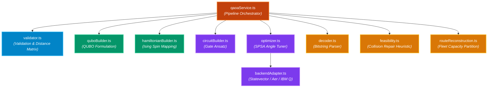

# 💻 Software Implementation Architecture


This document describes the modular codebase organization under `src/services/qaoa/`.

---

## 🎨 Module Dependency & Dataflow Diagram

> [!TIP]
> **Module Classification**:
> 🟦 **Setup & Types**: `types.ts`, `validator.ts`
> 🟩 **Math Formulation**: `quboBuilder.ts`, `hamiltonianBuilder.ts`
> 🟪 **Ansatz & Optimization**: `circuitBuilder.ts`, `optimizer.ts`, `backendAdapter.ts`
> 🟨 **Decoding & Repair**: `decoder.ts`, `feasibility.ts`, `routeReconstruction.ts`
> 🟧 **Orchestrator**: `qaoaService.ts`, `index.ts`



---

## Code Directory Structure

```text
src/services/qaoa/
├── types.ts                   # Type definitions, interfaces & QAOA result schemas
├── validator.ts               # Input problem validator & spatial distance matrix
├── quboBuilder.ts             # QUBO matrix formulation generator
├── hamiltonianBuilder.ts      # QUBO-to-Ising conversion & spin energy evaluator
├── circuitBuilder.ts          # QAOA parameterized quantum circuit ansatz builder
├── optimizer.ts               # Classical parameter optimizer (SPSA / COBYLA / ADAM)
├── backendAdapter.ts          # Simulator & quantum hardware execution adapter
├── decoder.ts                 # Bitstring-to-customer order decoder
├── feasibility.ts             # Feasibility checker & documented route repair
├── routeReconstruction.ts     # Vehicle capacity partitioning & route reconstruction
├── qaoaService.ts             # High-level pipeline orchestrator
└── index.ts                   # Barrel export file
```

---

## Core Components & Responsibilities

### 1. `validator.ts`
- Verifies depot existence, customer coordinate bounds, and constructs symmetric Euclidean distance matrix $d(i, j)$.

### 2. `quboBuilder.ts`
- Generates symmetric $M \times M$ matrix $Q$ representing distance costs and quadratic penalty terms $P_A, P_B$.

### 3. `hamiltonianBuilder.ts`
- Converts binary variables $x_i = \frac{1-Z_i}{2}$ to derive single Pauli-$Z_i$ linear coefficients $h_i$ and pair Pauli-$Z_i Z_j$ interaction coefficients $J_{ij}$.

### 4. `circuitBuilder.ts`
- Generates parameterized gate sequence instructions ($H$, $RZ$, $RX$, $CNOT$, $M$) for UI schematic rendering and simulator execution.

### 5. `optimizer.ts`
- Implements classical optimization loops tuning angles $\vec{\gamma}$ and $\vec{\beta}$ to minimize energy expectation $\langle H_C \rangle$.

### 6. `backendAdapter.ts`
- Decouples solver logic from execution engines. Supports local statevector calculation, shot-based sampling, and hardware configuration integration.

### 7. `decoder.ts` & `feasibility.ts`
- Translates binary bitstrings into customer sequences, detects position collisions/unvisited nodes, and applies a deterministic repair heuristic to guarantee physical route output.

### 8. `routeReconstruction.ts`
- Partitions ordered customer visits into fleet vehicles according to capacity limits $Q$, calculating exact vehicle travel distances and visit orders.
