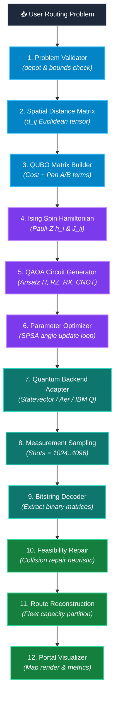
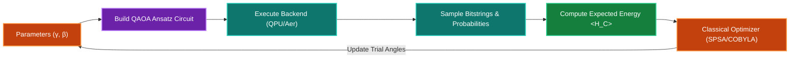

# 🚀 QAOA 12-Stage Routing Pipeline & Worked Example


This document provides a comprehensive breakdown of the **12-stage quantum routing pipeline** in **Q-Route**, followed by a worked 3-customer numerical example.

---

## 🔍 Interactive 12-Stage Pipeline Flowchart

> [!TIP]
> **Pipeline Color Legend**:
> 🟦 **Phase 1: Input & QUBO Matrix Formulation (Stages 1–3)**
> 🟪 **Phase 2: Quantum Spin & Ansatz Circuit (Stages 4–6)**
> 🪟 **Phase 3: Variational Loop & QPU Execution (Stages 7–9)**
> 🟩 **Phase 4: Decoding, Feasibility Repair & UI (Stages 10–12)**

<div align="center">
  <div style="background-color: #090d16; border: 1px solid #1e293b; border-radius: 16px; padding: 20px; box-shadow: 0 10px 30px rgba(0,0,0,0.5); max-width: 900px;">
    
    <!-- Control Bar -->
    <div style="display: flex; justify-content: space-between; align-items: center; background: #0f172a; padding: 10px 16px; border-radius: 10px; margin-bottom: 16px; border: 1px solid #334155;">
      <div style="display: flex; gap: 8px; align-items: center; color: #94a3b8; font-family: monospace; font-size: 12px; font-weight: bold;">
        <span style="display: inline-block; width: 10px; height: 10px; border-radius: 50%; background: #38bdf8;"></span>
        12-STAGE PIPELINE MAP (ZOOM ENABLED)
      </div>
      <div style="display: flex; gap: 8px;">
        <button onclick="const svg = document.getElementById('pipe-svg'); const cur = parseFloat(svg.getAttribute('data-scale')||'1'); const n = Math.min(cur+0.25, 2.5); svg.style.transform = `scale(${n})`; svg.setAttribute('data-scale', n); document.getElementById('pipe-zoom-lvl').innerText=Math.round(n*100)+'%';" style="background: #1e293b; color: #38bdf8; border: 1px solid #0284c7; border-radius: 6px; padding: 4px 12px; cursor: pointer; font-weight: bold; font-family: monospace;">➕ Zoom In</button>
        <button onclick="const svg = document.getElementById('pipe-svg'); const cur = parseFloat(svg.getAttribute('data-scale')||'1'); const n = Math.max(cur-0.25, 0.5); svg.style.transform = `scale(${n})`; svg.setAttribute('data-scale', n); document.getElementById('pipe-zoom-lvl').innerText=Math.round(n*100)+'%';" style="background: #1e293b; color: #38bdf8; border: 1px solid #0284c7; border-radius: 6px; padding: 4px 12px; cursor: pointer; font-weight: bold; font-family: monospace;">➖ Zoom Out</button>
        <button onclick="const svg = document.getElementById('pipe-svg'); svg.style.transform = 'scale(1)'; svg.setAttribute('data-scale', 1); document.getElementById('pipe-zoom-lvl').innerText='100%';" style="background: #1e293b; color: #cbd5e1; border: 1px solid #475569; border-radius: 6px; padding: 4px 12px; cursor: pointer; font-weight: bold; font-family: monospace;">↺ Reset</button>
        <span id="pipe-zoom-lvl" style="background: #0284c7; color: #fff; border-radius: 6px; padding: 4px 10px; font-family: monospace; font-size: 12px; font-weight: bold; display: flex; align-items: center;">100%</span>
      </div>
    </div>

    <!-- Scalable Canvas Container -->
    <div style="overflow: auto; max-height: 520px; padding: 20px 10px; background: radial-gradient(circle at center, #0f172a 0%, #030712 100%); border-radius: 12px;">
      <svg id="pipe-svg" data-scale="1" width="820" height="500" viewBox="0 0 820 500" xmlns="http://www.w3.org/2000/svg" style="transition: transform 0.3s ease; transform-origin: center top;">
        
        <defs>
          <linearGradient id="pBlue" x1="0%" y1="0%" x2="100%" y2="100%"><stop offset="0%" stop-color="#0369a1"/><stop offset="100%" stop-color="#0284c7"/></linearGradient>
          <linearGradient id="pPurple" x1="0%" y1="0%" x2="100%" y2="100%"><stop offset="0%" stop-color="#6b21a8"/><stop offset="100%" stop-color="#a855f7"/></linearGradient>
          <linearGradient id="pTeal" x1="0%" y1="0%" x2="100%" y2="100%"><stop offset="0%" stop-color="#0f766e"/><stop offset="100%" stop-color="#14b8a6"/></linearGradient>
          <linearGradient id="pGreen" x1="0%" y1="0%" x2="100%" y2="100%"><stop offset="0%" stop-color="#15803d"/><stop offset="100%" stop-color="#22c55e"/></linearGradient>
          <marker id="pipeArrow" viewBox="0 0 10 10" refX="6" refY="5" markerWidth="6" markerHeight="6" orient="auto-start-reverse">
            <path d="M 0 0 L 10 5 L 0 10 z" fill="#38bdf8" />
          </marker>
        </defs>

        <!-- INPUT START -->
        <rect x="290" y="10" width="240" height="40" rx="8" fill="#1e293b" stroke="#38bdf8" stroke-width="2" />
        <text x="410" y="35" fill="#f8fafc" font-family="monospace" font-weight="bold" font-size="13" text-anchor="middle">📥 User Routing Problem</text>
        <path d="M 410 50 L 410 70" stroke="#38bdf8" stroke-width="2" marker-end="url(#pipeArrow)" />

        <!-- PHASE 1: PREPARATION & QUBO (BLUE) -->
        <rect x="40" y="75" width="740" height="90" rx="10" fill="url(#pBlue)" stroke="#38bdf8" stroke-width="1.5" opacity="0.9" />
        <text x="55" y="96" fill="#e0f2fe" font-family="sans-serif" font-weight="extrabold" font-size="11" letter-spacing="1">PHASE 1: INPUT VALIDATION & QUBO MATRIX FORMULATION</text>
        
        <rect x="60" y="106" width="200" height="45" rx="6" fill="#0f172a" stroke="#0284c7" stroke-width="1" />
        <text x="160" y="127" fill="#7dd3fc" font-family="monospace" font-size="11" font-weight="bold" text-anchor="middle">1. Problem Validator</text>
        <text x="160" y="142" fill="#94a3b8" font-family="sans-serif" font-size="9" text-anchor="middle">Bounds & Depot Check</text>

        <path d="M 260 128 L 285 128" stroke="#7dd3fc" stroke-width="2" marker-end="url(#pipeArrow)" />

        <rect x="290" y="106" width="220" height="45" rx="6" fill="#0f172a" stroke="#0284c7" stroke-width="1" />
        <text x="400" y="127" fill="#7dd3fc" font-family="monospace" font-size="11" font-weight="bold" text-anchor="middle">2. Spatial Distance Matrix</text>
        <text x="400" y="142" fill="#94a3b8" font-family="sans-serif" font-size="9" text-anchor="middle">Symmetric Euclidean d(i,j)</text>

        <path d="M 510 128 L 535 128" stroke="#7dd3fc" stroke-width="2" marker-end="url(#pipeArrow)" />

        <rect x="540" y="106" width="220" height="45" rx="6" fill="#0f172a" stroke="#0284c7" stroke-width="1" />
        <text x="650" y="127" fill="#7dd3fc" font-family="monospace" font-size="11" font-weight="bold" text-anchor="middle">3. QUBO Matrix Builder</text>
        <text x="650" y="142" fill="#94a3b8" font-family="sans-serif" font-size="9" text-anchor="middle">NxN Costs + Pen A/B</text>

        <path d="M 650 151 L 650 180" stroke="#38bdf8" stroke-width="2" marker-end="url(#pipeArrow)" />

        <!-- PHASE 2: QUANTUM CIRCUIT (PURPLE) -->
        <rect x="40" y="185" width="740" height="90" rx="10" fill="url(#pPurple)" stroke="#c084fc" stroke-width="1.5" opacity="0.9" />
        <text x="55" y="206" fill="#f3e8ff" font-family="sans-serif" font-weight="extrabold" font-size="11" letter-spacing="1">PHASE 2: ISING HAMILTONIAN & QAOA CIRCUIT ANSATZ</text>

        <rect x="60" y="216" width="220" height="45" rx="6" fill="#0f172a" stroke="#a855f7" stroke-width="1" />
        <text x="170" y="237" fill="#e9d5ff" font-family="monospace" font-size="11" font-weight="bold" text-anchor="middle">4. Ising Spin Hamiltonian</text>
        <text x="170" y="252" fill="#94a3b8" font-family="sans-serif" font-size="9" text-anchor="middle">x_i = (1 - Z_i) / 2</text>

        <path d="M 280 238 L 305 238" stroke="#e9d5ff" stroke-width="2" marker-end="url(#pipeArrow)" />

        <rect x="310" y="216" width="220" height="45" rx="6" fill="#0f172a" stroke="#a855f7" stroke-width="1" />
        <text x="420" y="237" fill="#e9d5ff" font-family="monospace" font-size="11" font-weight="bold" text-anchor="middle">5. QAOA Circuit Generator</text>
        <text x="420" y="252" fill="#94a3b8" font-family="sans-serif" font-size="9" text-anchor="middle">p-layer H, RZ, RX, CNOT</text>

        <path d="M 530 238 L 555 238" stroke="#e9d5ff" stroke-width="2" marker-end="url(#pipeArrow)" />

        <rect x="560" y="216" width="200" height="45" rx="6" fill="#0f172a" stroke="#a855f7" stroke-width="1" />
        <text x="660" y="237" fill="#e9d5ff" font-family="monospace" font-size="11" font-weight="bold" text-anchor="middle">6. Parameter Optimizer</text>
        <text x="660" y="252" fill="#94a3b8" font-family="sans-serif" font-size="9" text-anchor="middle">SPSA / COBYLA Loop</text>

        <path d="M 170 261 L 170 290" stroke="#38bdf8" stroke-width="2" marker-end="url(#pipeArrow)" />

        <!-- PHASE 3: EXECUTION (TEAL) -->
        <rect x="40" y="295" width="740" height="90" rx="10" fill="url(#pTeal)" stroke="#2dd4bf" stroke-width="1.5" opacity="0.9" />
        <text x="55" y="316" fill="#ccfbf1" font-family="sans-serif" font-weight="extrabold" font-size="11" letter-spacing="1">PHASE 3: BACKEND EXECUTION & MEASUREMENT SAMPLING</text>

        <rect x="60" y="326" width="220" height="45" rx="6" fill="#0f172a" stroke="#14b8a6" stroke-width="1" />
        <text x="170" y="347" fill="#99f6e4" font-family="monospace" font-size="11" font-weight="bold" text-anchor="middle">7. Quantum Backend Adapter</text>
        <text x="170" y="362" fill="#94a3b8" font-family="sans-serif" font-size="9" text-anchor="middle">Statevector / Aer / IBM Q</text>

        <path d="M 280 348 L 305 348" stroke="#99f6e4" stroke-width="2" marker-end="url(#pipeArrow)" />

        <rect x="310" y="326" width="220" height="45" rx="6" fill="#0f172a" stroke="#14b8a6" stroke-width="1" />
        <text x="420" y="347" fill="#99f6e4" font-family="monospace" font-size="11" font-weight="bold" text-anchor="middle">8. Measurement Sampling</text>
        <text x="420" y="362" fill="#94a3b8" font-family="sans-serif" font-size="9" text-anchor="middle">Shots = 1024..4096</text>

        <path d="M 530 348 L 555 348" stroke="#99f6e4" stroke-width="2" marker-end="url(#pipeArrow)" />

        <rect x="560" y="326" width="200" height="45" rx="6" fill="#0f172a" stroke="#14b8a6" stroke-width="1" />
        <text x="660" y="347" fill="#99f6e4" font-family="monospace" font-size="11" font-weight="bold" text-anchor="middle">9. Bitstring Decoder</text>
        <text x="660" y="362" fill="#94a3b8" font-family="sans-serif" font-size="9" text-anchor="middle">Top Probability States</text>

        <path d="M 660 371 L 660 400" stroke="#38bdf8" stroke-width="2" marker-end="url(#pipeArrow)" />

        <!-- PHASE 4: POST-PROCESSING & UI (GREEN) -->
        <rect x="40" y="405" width="740" height="85" rx="10" fill="url(#pGreen)" stroke="#34d399" stroke-width="1.5" opacity="0.9" />
        <text x="55" y="424" fill="#dcfce7" font-family="sans-serif" font-weight="extrabold" font-size="11" letter-spacing="1">PHASE 4: FEASIBILITY REPAIR & PORTAL VISUALIZATION</text>

        <rect x="60" y="434" width="230" height="45" rx="6" fill="#0f172a" stroke="#22c55e" stroke-width="1" />
        <text x="175" y="455" fill="#86efac" font-family="monospace" font-size="11" font-weight="bold" text-anchor="middle">10. Feasibility & Repair</text>
        <text x="175" y="470" fill="#94a3b8" font-family="sans-serif" font-size="9" text-anchor="middle">Collision Repair Heuristic</text>

        <path d="M 290 456 L 315 456" stroke="#86efac" stroke-width="2" marker-end="url(#pipeArrow)" />

        <rect x="320" y="434" width="220" height="45" rx="6" fill="#0f172a" stroke="#22c55e" stroke-width="1" />
        <text x="430" y="455" fill="#86efac" font-family="monospace" font-size="11" font-weight="bold" text-anchor="middle">11. Route Reconstruction</text>
        <text x="430" y="470" fill="#94a3b8" font-family="sans-serif" font-size="9" text-anchor="middle">Capacity Partitioning</text>

        <path d="M 540 456 L 565 456" stroke="#86efac" stroke-width="2" marker-end="url(#pipeArrow)" />

        <rect x="570" y="434" width="190" height="45" rx="6" fill="#0f172a" stroke="#22c55e" stroke-width="1" />
        <text x="665" y="455" fill="#86efac" font-family="monospace" font-size="11" font-weight="bold" text-anchor="middle">12. Portal Visualizer</text>
        <text x="665" y="470" fill="#94a3b8" font-family="sans-serif" font-size="9" text-anchor="middle">Render Maps & Result</text>
      </svg>
    </div>
  </div>
</div>

---

## 🎨 Color-Coded 12-Stage Pipeline (Mermaid)



---

## 🔁 QAOA Classical-Quantum Variational Loop

The optimization loop dynamically adjusts cost angles $\gamma$ and mixer angles $\beta$:




---

## 3. Worked Example: 3 Customers

Consider a central depot $D$ and 3 customer points $C_1, C_2, C_3$:

```text
       C1 (100, 300)
      /  \
     /    \
Depot (0,0)── C2 (300, 0)
     \    /
      \  /
       C3 (200, -200)
```

### Candidate Configurations & Bitstrings

With $N=3$ customers, there are $M = 3 \times 3 = 9$ binary variables:

| Tour Route | Assigned Binary Matrix | Bitstring $x_{i,t}$ | Total Cost | Feasibility |
| :--- | :--- | :--- | :--- | :--- |
| **Depot $\to C_1 \to C_2 \to C_3 \to$ Depot** | $x_{1,0}=1, x_{2,1}=1, x_{3,2}=1$ | `100 010 001` | **840 km** | **Valid** |
| **Depot $\to C_2 \to C_1 \to C_3 \to$ Depot** | $x_{2,0}=1, x_{1,1}=1, x_{3,2}=1$ | `010 100 001` | **910 km** | **Valid** |
| Collided Candidate | $x_{1,0}=1, x_{1,1}=1, x_{3,2}=1$ | `110 000 001` | Penalty $+1000$ | **Invalid (Collided)** |

### QAOA Processing

1. **QUBO Construction**: Constructs $9 \times 9$ matrix $Q$ with $P_A = 500, P_B = 500$.
2. **Circuit Execution**: Applies $p$-layer gates $H^{\otimes 9} \to RZ(2\gamma h_i) \to CNOT \to RX(2\beta)$.
3. **Sampling**: Statevector calculation returns high probability ($P > 0.38$) for state `|100010001⟩`.
4. **Decoding & Reconstruction**: Decodes to $C_1 \to C_2 \to C_3$, confirms zero constraint violations, and constructs vehicle routes.
