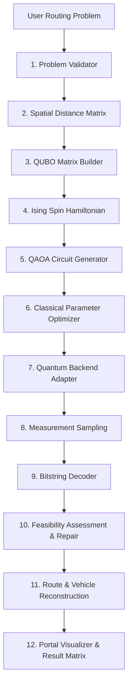
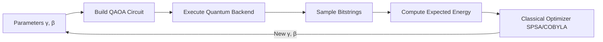

# QAOA 12-Stage Routing Pipeline & Worked Example

This document explains the end-to-end architecture pipeline of the Q-Route QAOA service and walks through a worked example with 3 customers.

---

## 1. Overall Architecture Flow Diagram



---

## 2. QAOA Classical-Quantum Optimization Loop



---

## 3. Worked Example: 3 Customers

Consider a central depot $D$ and 3 customer points $C_1, C_2, C_3$:

```text
       C1 (100, 300)
      /  \
     /    \
Depot (0,0)── C2 (300, 0)
     \    /
      \  /
       C3 (200, -200)
```

### Candidate Configurations & Bitstrings

With $N=3$ customers, there are $M = 3 \times 3 = 9$ binary variables:

| Tour Route | Assigned Binary Matrix | Bitstring $x_{i,t}$ | Total Cost | Feasibility |
| :--- | :--- | :--- | :--- | :--- |
| **Depot $\to C_1 \to C_2 \to C_3 \to$ Depot** | $x_{1,0}=1, x_{2,1}=1, x_{3,2}=1$ | `100 010 001` | **840 km** | **Valid** |
| **Depot $\to C_2 \to C_1 \to C_3 \to$ Depot** | $x_{2,0}=1, x_{1,1}=1, x_{3,2}=1$ | `010 100 001` | **910 km** | **Valid** |
| Collided Candidate | $x_{1,0}=1, x_{1,1}=1, x_{3,2}=1$ | `110 000 001` | Penalty $+1000$ | **Invalid (Collided)** |

### QAOA Processing

1. **QUBO Construction**: Constructs $9 \times 9$ matrix $Q$ with $P_A = 500, P_B = 500$.
2. **Circuit Execution**: Applies $p$-layer gates $H^{\otimes 9} \to RZ(2\gamma h_i) \to CNOT \to RX(2\beta)$.
3. **Sampling**: Statevector calculation returns high probability ($P > 0.38$) for state `|100010001⟩`.
4. **Decoding & Reconstruction**: Decodes to $C_1 \to C_2 \to C_3$, confirms zero constraint violations, and constructs vehicle routes.
